# Database — MI.Organizzo

Documentazione completa dei modelli Django. Ogni file in `models/` è un nodo nel Graph View — i [[WikiLink]] rappresentano FK e M2M reali nel codice.

## Dominio finanziario
- [[Currency]] · [[Account]] · [[Tag]]
- [[IncomeSource]] · [[VatCode]] · [[PaymentMethod]] · [[ShippingMethod]]
- [[Quote]] · [[QuoteLine]] · [[Invoice]] · [[WorkOrder]]
- [[Subscription]] · [[SubscriptionOccurrence]]
- [[Transaction]]

## Progetti e clienti
- [[Customer]] · [[Project]] · [[SubProject]] · [[SubProjectActivity]]
- [[Category]] · [[ProjectNote]] · [[ProjectHeroActionsConfig]]
- [[Contact]] · [[ContactDeliveryAddress]] · [[ContactToolbox]] · [[ContactPriceList]] · [[ContactPriceListItem]]

## Pianificazione
- [[AgendaItem]] · [[WorkLog]]
- [[PlannerItem]]
- [[Routine]] · [[RoutineCategory]] · [[RoutineItem]] · [[RoutineCheck]]
- [[Task]]

## Conoscenza e cattura
- [[MemoryStockItem]]
- [[ArchibaldMailboxConfig]] · [[ArchibaldEmailFlagRule]] · [[ArchibaldInboundCategory]] · [[ArchibaldEmailMessage]]

## Sicurezza
- [[VaultProfile]] · [[VaultItem]]

## Sistema
- [[Payee]]
- [[UserHeroActionsConfig]] · [[UserNavConfig]] · [[MobileApiSession]]
- [[DavAccount]] · [[DavExternalAccount]] · [[DavTeam]] · [[DavManagedCalendar]] · [[DavCalendarGrant]]
- [[WorkbenchItem]] · [[DebugChangeLog]]

---

## ERD globale (Mermaid)

```mermaid
erDiagram
  Transaction }o--|| Account : "account"
  Transaction }o--|| Currency : "currency"
  Transaction }o--o| Project : "project"
  Transaction }o--o| Category : "category"
  Transaction }o--o| Payee : "payee"
  Transaction }o--o| IncomeSource : "income_source"
  Transaction }o--o| Subscription : "source_subscription"
  Transaction }o--|{ Tag : "tags (M2M)"

  SubscriptionOccurrence }o--|| Subscription : "subscription"
  SubscriptionOccurrence }o--|| Currency : "currency"
  SubscriptionOccurrence |o--o| Transaction : "transaction (1:1)"

  Subscription }o--|| Account : "account"
  Subscription }o--|| Currency : "currency"
  Subscription }o--o| Payee : "payee"
  Subscription }o--o| Category : "category"
  Subscription }o--o| Project : "project"
  Subscription }o--|{ Tag : "tags (M2M)"

  Quote }o--o| Customer : "customer"
  Quote }o--o| Project : "project"
  Quote }o--o| ContactDeliveryAddress : "delivery_address"
  Quote }o--|| Currency : "currency"
  Quote }o--o| VatCode : "vat_code"
  Quote }o--o| PaymentMethod : "payment_method"
  Quote }o--o| ShippingMethod : "shipping_method"
  QuoteLine }o--|| Quote : "quote"

  Invoice }o--o| Quote : "quote"
  Invoice }o--o| Customer : "customer"
  Invoice }o--o| Project : "project"
  Invoice }o--o| Account : "account"
  Invoice }o--|| Currency : "currency"

  WorkOrder }o--o| Customer : "customer"
  WorkOrder }o--o| Project : "project"
  WorkOrder }o--o| Account : "account"
  WorkOrder }o--|| Currency : "currency"

  Account }o--|| Currency : "currency"

  Project }o--o| Customer : "customer"
  Project }o--o| Category : "category"
  SubProject }o--|| Project : "project"
  SubProjectActivity }o--|| SubProject : "subproject"
  ProjectNote }o--|| Project : "project"

  Contact ||--o| ContactToolbox : "toolbox (1:1)"
  ContactDeliveryAddress }o--|| Contact : "contact"
  ContactToolbox ||--|{ ContactPriceList : "price_lists"
  ContactPriceList ||--|{ ContactPriceListItem : "items"

  AgendaItem }o--o| Project : "project"
  PlannerItem }o--o| Project : "project"
  PlannerItem }o--o| Category : "category"
  Task }o--o| Project : "project"
  Task }o--o| Category : "category"

  Routine }o--o| RoutineCategory : "category"
  RoutineItem }o--|| Routine : "routine"
  RoutineItem }o--o| RoutineCategory : "category"
  RoutineItem }o--o| Project : "project"
  RoutineCheck }o--|| RoutineItem : "item"

  ArchibaldEmailMessage }o--|| ArchibaldMailboxConfig : "config"
  ArchibaldEmailMessage }o--o| ArchibaldEmailMessage : "related_message (self)"
  ArchibaldEmailMessage }o--o| ArchibaldInboundCategory : "classification_category"

  DavCalendarGrant }o--|| DavExternalAccount : "external_account"
  DavCalendarGrant }o--|| DavManagedCalendar : "calendar"
```

