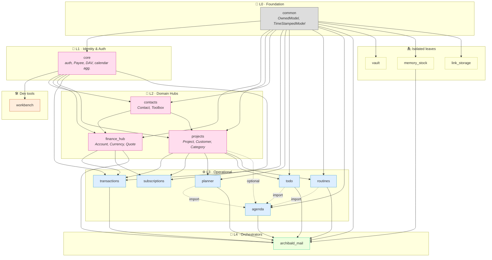
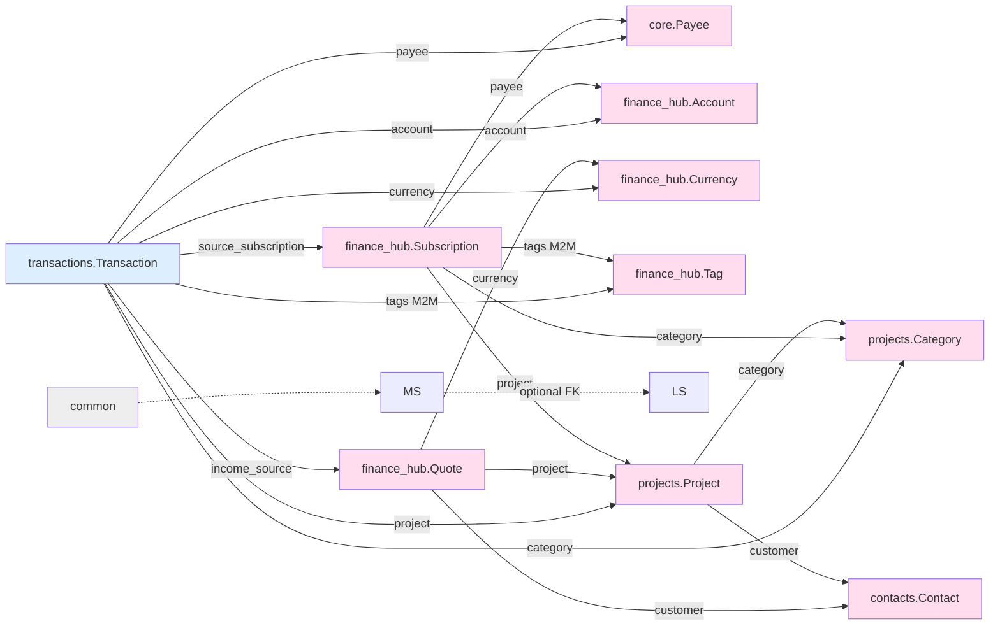
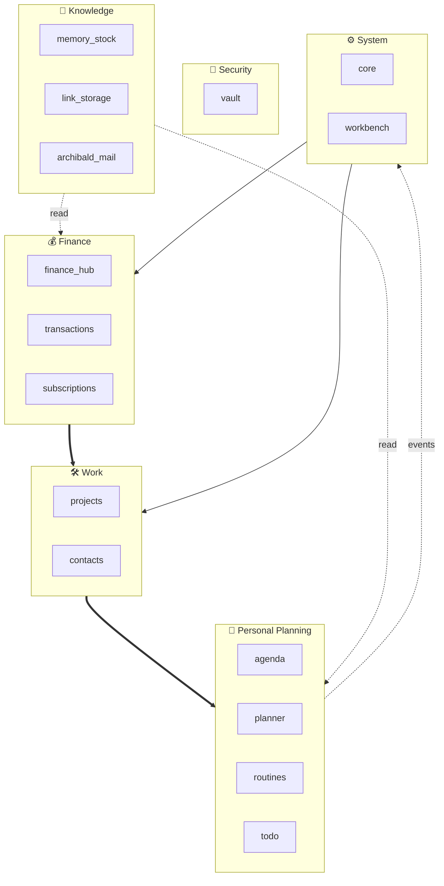

# 🔗 Dipendenze tra app

Mappa autoritativa delle dipendenze del progetto, derivata dai modelli (`ForeignKey`/`ManyToMany`) e dagli import Python cross-app. Aggiornata: 2026-04-27.

## TL;DR — architettura a 6 livelli

> **Regola**: ogni livello può dipendere solo dai livelli inferiori (no upward imports). Eccezione documentata: `core` aggrega eventi calendario da L3 via lazy import.

## Dipendenze dati (ForeignKey/M2M)

Solo riferimenti **dichiarati nei modelli** (DB-level).

### Riepilogo FK per app

| App | Dipende da (FK) | Note |
|-----|-----------------|------|
| **common** | — | foundation |
| **core** | django.User | OneToOne con user; nessuna FK app-level |
| **contacts** | self only | grafo interno (Contact ↔ Toolbox ↔ PriceList) |
| **finance_hub** | core.Payee, projects.{Project,Category}, contacts.Contact | hub centrale |
| **projects** | contacts.Contact, finance_hub | tramite import; FK a self (subproject) |
| **transactions** | finance_hub.{Account,Currency,Tag,Subscription,Quote}, projects.{Project,Category}, core.Payee | ledger collega tutto |
| **subscriptions** | (alias di finance_hub.Subscription) | stub legacy |
| **planner** | projects.{Project,Category} | + auto-crea ProjectNote |
| **todo** | projects.{Project,Category} | trasferimento ↔ planner |
| **routines** | projects.{Project,Category} | self-FK (Routine→Item→Check) |
| **agenda** | projects.Project | aggregatore eventi |
| **archibald_mail** | self only | FK interne (Config, Message, Category) |
| **memory_stock** | — | hub memoria (base per Link, Note, ecc.) |
| **vault** | — | isolato |
| **link_storage** | memory_stock.MemoryStockItem | specializzazione Link (opzionale FK OneToOne) |
| **workbench** | django.User | log debug per user |

## Dipendenze codice (import cross-app)

Le dipendenze a runtime spesso superano gli FK (services, signals, viste aggregate):

| App | Importa da |
|-----|------------|
| **common** | — |
| **vault** | common |
| **memory_stock** | common |
| **link_storage** | common |
| **workbench** | common, core |
| **planner** | common, projects |
| **todo** | common, core, projects |
| **routines** | common, projects |
| **contacts** | common, core, finance_hub, projects |
| **finance_hub** | common, contacts, core, projects |
| **transactions** | common, contacts, core, finance_hub, projects |
| **agenda** | common, core, planner, projects, routines, todo |
| **subscriptions** | core, finance_hub, projects, transactions |
| **income** | contacts, finance_hub, projects, transactions *(stub)* |
| **outcome** | finance_hub *(stub)* |
| **projects** | common, contacts, core, finance_hub, planner, routines, todo, transactions |
| **core** | + agenda, archibald, contacts, finance_hub, planner, projects, routines, todo, transactions |
| **archibald_mail** | agenda, archibald, common, finance_hub, memory_stock, planner, routines, todo |

> ⚠️ **Cicli osservati**:
> - `projects ↔ contacts` (FK customer ↔ import services)
> - `projects ↔ finance_hub` (FK + import bidirezionale)
> - `core` importa da L3 per il calendario aggregato → mitigato con **lazy imports** dentro view/services
> 
> Questi cicli sono accettati come *trade-off* perché rappresentano hub operativi. Vanno tenuti d'occhio: nuove FK upward sono da evitare.

## Mappa per dominio funzionale

## Cosa significa, operativamente

- **Per modificare `common`** → impatto totale (tutti gli OwnedModel). Test full suite.
- **Per modificare `core.Payee`** → tocchi finance_hub.Subscription, transactions.Transaction.
- **Per modificare `finance_hub.Account/Currency`** → tocchi transactions e subscriptions.
- **Per modificare `projects.Project`** → tocchi transactions, finance_hub, planner, todo, routines, agenda.
- **Per aggiungere nuova app L3** → dipende da L2 (hub) o L1 (core), mai upward.
- **Le isolate** (vault) → modifiche locali, zero blast radius.
- **Memory hub** (memory_stock) → hub per la conoscenza, link_storage è una specializzazione (FK opzionale).
- **Aggiungere nuovo tipo a memory_stock** → creare modello con FK a MemoryStockItem, come Link.

## Vedi anche

- [[project-identity]] - Visione e principi
- [[moc-apps]] - Map of Content delle app
- [[models]] - ERD completo dei modelli
- [[business-logic]] - Workflow di business
