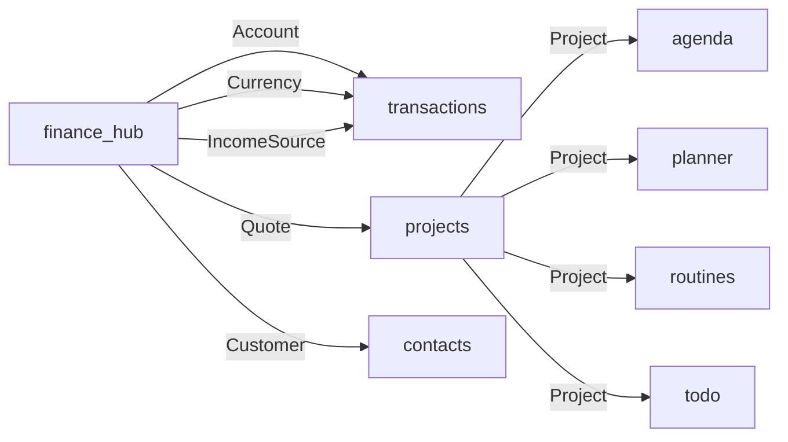
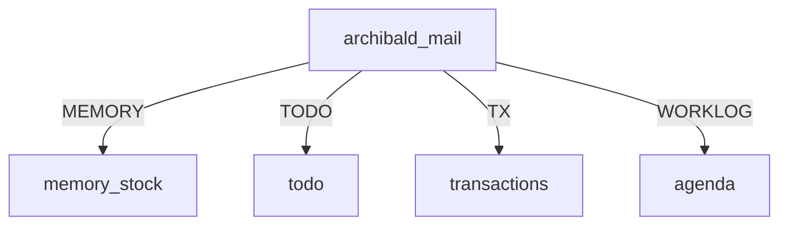

# MOC - Applicazioni MIO Master

Map of Content per tutte le app Django del progetto. Vedere graph view per relazioni visive.

## Per Domain

### Finance Domain
```dataview
TABLE WITHOUT ID
  link(file.link, "App") as App,
  choice(contains(file.tags, "removed"), "⚠️ RIMOSSO", "✅ Attivo") as Stato
FROM "docs/apps"
WHERE contains(file.tags, "finance")
SORT file.name
```

- [[apps/finance_hub]] - Core finance (Quote, Invoice, Account, Subscription)
- [[apps/subscriptions]] - Recurring subscriptions  
- [[apps/transactions]] - Transactions ledger
- [[apps/income]] - Income sources (stub → finance_hub)
- [[apps/outcome]] - Work orders (stub → finance_hub)

### Project Domain
```dataview
TABLE WITHOUT ID link(file.link, "App") FROM "docs/apps" WHERE contains(file.tags, "projects") SORT file.name
```

- [[apps/projects]] - Project management
- [[apps/contacts]] - Contact management

### Personal Planning
```dataview
TABLE WITHOUT ID link(file.link, "App") FROM "docs/apps" WHERE contains(file.tags, "planner") SORT file.name
```

- [[apps/agenda]] - Daily agenda
- [[apps/planner]] - Planning/budget
- [[apps/routines]] - Weekly routines
- [[apps/todo]] - Task management

### Storage & Notes
```dataview
TABLE WITHOUT ID link(file.link, "App") FROM "docs/apps" WHERE contains(file.tags, "storage") SORT file.name
```

- [[apps/memory_stock]] - Knowledge capture
- [[apps/link_storage]] - Bookmarks
- [[apps/vault]] - Encrypted secrets

### AI & Email
```dataview
TABLE WITHOUT ID link(file.link, "App") FROM "docs/apps" WHERE contains(file.tags, "ai") SORT file.name
```

- [[apps/archibald_mail]] - Email AI (attivo)
- ~~[[apps/archibald]]~~ - AI assistant (**rimosso**)

### System
```dataview
TABLE WITHOUT ID link(file.link, "App") FROM "docs/apps" WHERE contains(file.tags, "system") SORT file.name
```

- [[apps/core]] - Core (auth, users, DAV)
- [[apps/workbench]] - Developer tools

## By Status

### ✅ Attive
```dataview
TABLE WITHOUT ID link(file.link, "App") as App
FROM "docs/apps"
WHERE !contains(file.tags, "removed")
SORT file.name
```

### ⚠️ Rimosse
```dataview
TABLE WITHOUT ID link(file.link, "App") as App, file.cdate as "Rimosso il"
FROM "docs/apps"
WHERE contains(file.tags, "removed")
SORT file.name
```

## Connected To

### Finance Hub (central)


### archibald_mail (attivo)


## Quick Reference

| App | Status | Note |
|-----|--------|------|
| finance_hub | ✅ | Core |
| transactions | ✅ | Finance |
| projects | ✅ | CRM |
| core | ✅ | Auth/DAV |
| contacts | ✅ | Address book |
| agenda | ✅ | Calendar |
| planner | ✅ | Planning |
| routines | ✅ | Habits |
| todo | ✅ | Tasks |
| memory_stock | ✅ | Notes |
| archibald_mail | ✅ | Email |
| vault | ✅ | Passwords |
| workbench | ✅ | Dev tools |
| subscriptions | ✅ | Alias→FH |
| income | ✅ | Alias→FH |
| outcome | ✅ | Stub |
| link_storage | ✅ | Bookmarks |
| archibald | ⚠️ | **rimosso** |

---
*Last updated: [[2026-04-27]]*