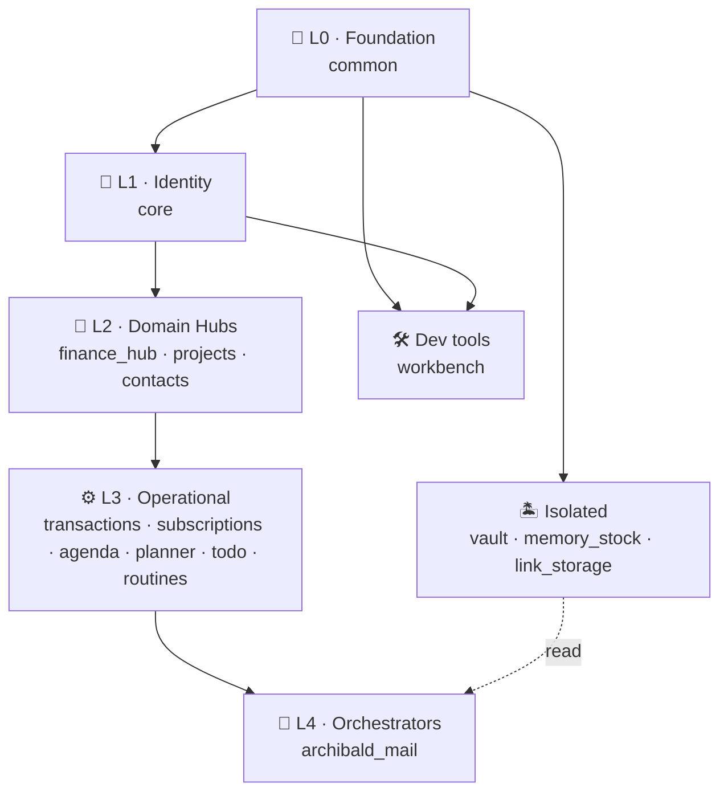
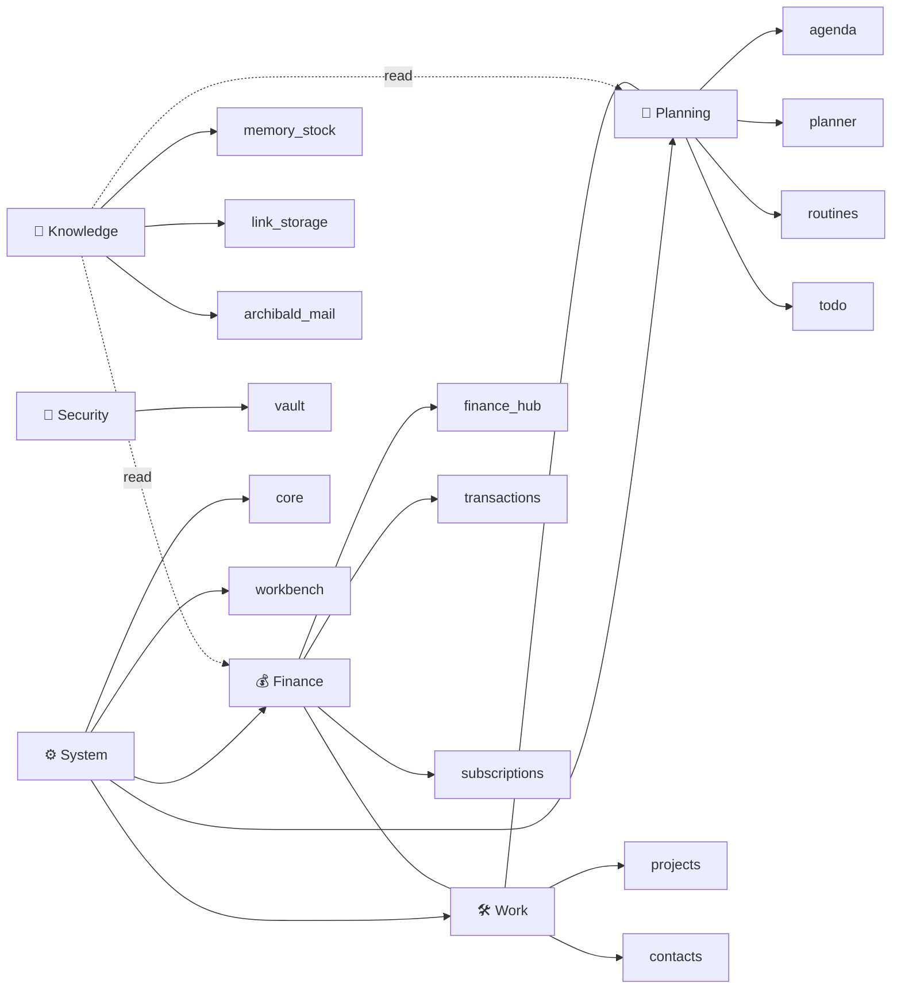

# 🎯 MI.Organizzo — ERP personale, senza dimenticazioni

> **MI.Organizzo** è un monolite Django per **organizzazione personale completa**: finanza, progetti, planning quotidiano, knowledge base e vault cifrato — il tutto sotto un'unica ownership per utente, senza flussi di dimenticazione.

## In una frase

Un ERP personale auto-ospitato, dove ogni domain (denaro, tempo, contatti, conoscenza, segreti) è un'app Django collegata in un grafo coerente, e ogni email con il flag giusto diventa un ricordo salvato automaticamente.

## Principi guida

1. **Self-hosted first** — deploy su VPS proprio, niente SaaS opaco. Stack: Django + Postgres + Caddy + Radicale (CalDAV).
2. **Owned data model** — ogni record eredita da `common.OwnedModel`, scoping per utente garantito a livello base.
3. **Hub finanziario centrale** — `finance_hub` è il fulcro: Account, Currency, Customer, Quote/Invoice/WorkOrder convergono qui.
4. **Federazione di app focalizzate** — ogni app ha un dominio chiaro, link espliciti via FK invece di catch-all.
5. **UI pragmatica** — UIKit + HTMX + Stimulus, niente SPA. LESS ibrido (compile-on-request in DEV, statico in PROD).
6. **Email come interfaccia** — `archibald_mail` processa email con flag soggetto (`[MEMORY]`, `[TODO]`, `[TX]`, `[REMINDER]`, `[WORKLOG_AM/PM]`), salvando automaticamente in memory_stock.
7. **Senza dimenticazione** — ogni flusso operativo ha un punto di cattura: email flag, form rapido, quick action da dashboard.

## Architettura a 6 livelli

> Ogni livello dipende solo da quelli inferiori. Per la mappa autoritativa delle dipendenze (FK + import) vedi **[[dependencies]]**.



### Dominio funzionale (cross-cutting)



## Domain detail

### 💰 Finance ([[apps/finance_hub|hub]])
Il cuore commerciale: clienti → preventivi → fatture/lavori → pagamenti → ledger. Subscription ricorrenti generano Occurrence pianificate, conciliabili con Transaction.
- Vedi: [[apps/finance_hub]], [[apps/transactions]], [[apps/subscriptions]], [[business-logic]]

### 🛠️ Projects ([[apps/projects|hub]])
Project + Customer + Category, con storyboard (note, task, planner item, timeline). Ogni progetto può avere hero actions custom.
- Vedi: [[apps/projects]], [[apps/contacts]]

### 📅 Personal planning
Quattro app complementari per orizzonti diversi:
- **agenda** — calendario aggregato + WorkLog mattina/pomeriggio
- **planner** — item con amount/category/project (auto-crea ProjectNote)
- **routines** — routine settimanali con check planned/done/skipped
- **todo** — task con priority/due date, transferibili a planner

### 🧠 Knowledge
- **memory_stock** — appunti rapidi (anche cattura via email `[MEMORY]`)
- **link_storage** — bookmarks con importance + note
- **archibald_mail** — cattura email via flag soggetto → salvataggio automatico in memory_stock

### 🔐 Security
- **vault** — TOTP setup + Fernet-encrypted password/note items + lock con timeout sessione

### ⚙️ System
- **core** — auth, signup, dashboard, calendario aggregato, account finanziari, DAV provisioning
- **workbench** — debug, schema explorer, ERD Mermaid (escluso dal tema globale)

## Collegamenti chiave

```dataview
TABLE WITHOUT ID
  link(file.link, "Doc") as Doc,
  file.tags as Tags
FROM "docs"
WHERE contains(file.tags, "moc") OR contains(file.tags, "root") OR contains(file.tags, "identity")
SORT file.name
```

## Stack tecnico

| Layer | Tech |
|-------|------|
| Backend | Django 6.0.1, Python 3.12 |
| DB | PostgreSQL 16 |
| AI | rimosso (era OpenAI opt-in, ora nessuna dipendenza AI) |
| Frontend | UIKit + HTMX + Stimulus |
| Build | pnpm + Vite, LESS ibrido |
| Crypto | cryptography (Fernet), pyotp |
| Deploy | Docker Compose (web + mail_worker + db + radicale + caddy) |
| Sync | Radicale CalDAV/CardDAV |
| Mobile | API JSON dedicata `/api/mobile/*` con bearer token |

## Convenzioni interne

- **Ownership** → `common.OwnedModel` (user FK + `objects.for_user(u)`)
- **Timestamps** → `common.TimeStampedModel`
- **Status enums** → `TextChoices` per Quote/Invoice/WorkOrder/Subscription
- **Routing email** → flag in subject: `[MEMORY]`, `[TODO]`, `[TX]`, `[ARCHI]`, `[WORKLOG_AM/PM]`
- **UI mode** → `UI_STYLE_MODE=DEV|PROD` controlla compilazione LESS

## Stato attuale (snapshot 2026-04-27)

| Status | Apps |
|--------|------|
| ✅ Attive (13) | finance_hub, transactions, projects, core, contacts, agenda, planner, routines, todo, memory_stock, vault, workbench, archibald_mail |
| ⚠️ Stub/alias (4) | subscriptions→FH, income→FH, outcome, link_storage |
| ❌ Rimosso (1) | archibald (27 Apr 2026) → vedi [[archibald-removal-analysis]] |

## Navigazione

- 🏠 [[index]] — index documentazione
- 🔗 [[dependencies]] — dipendenze tra app (FK + import)
- 🗺️ [[moc-apps]] — Map of Content app
- 🗃️ [[models]] — modelli e relazioni (ERD)
- 🌐 [[api]] — endpoint API
- 🧠 [[business-logic]] — workflow di business
- 🚀 [[deployment]] — deploy Docker/VPS
- 📅 [[caldav-unification]] — integrazione CalDAV/CardDAV
- 🔍 [[views]] — viste e URL

---
*Hub principale del vault — apri Graph View (Ctrl+G) per vedere il grafo delle relazioni.*
